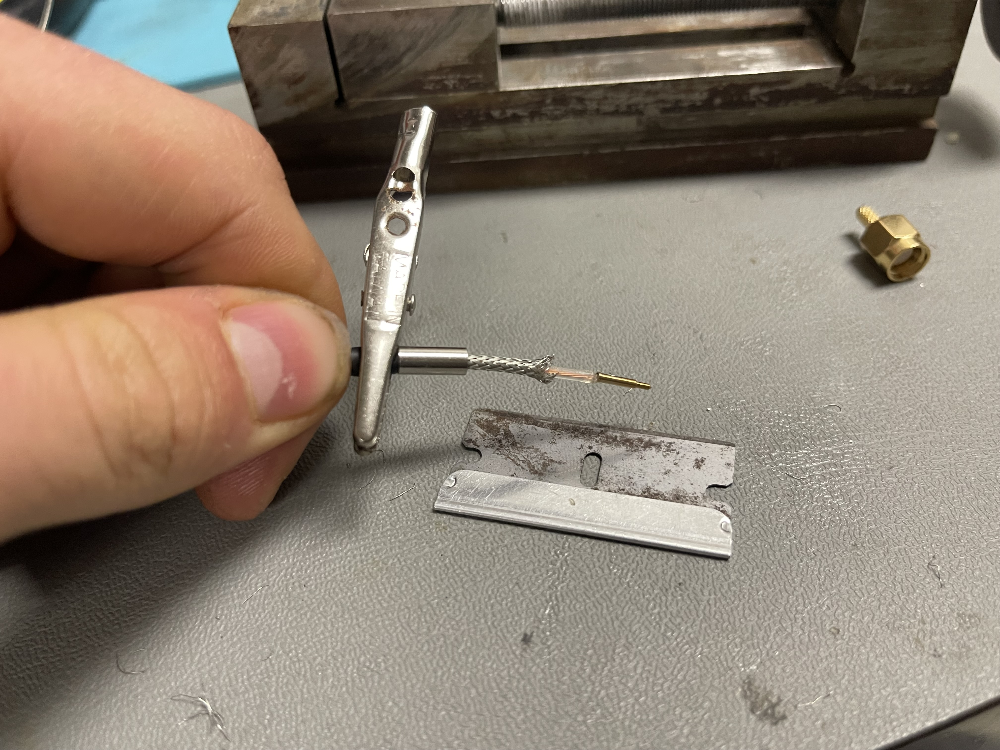
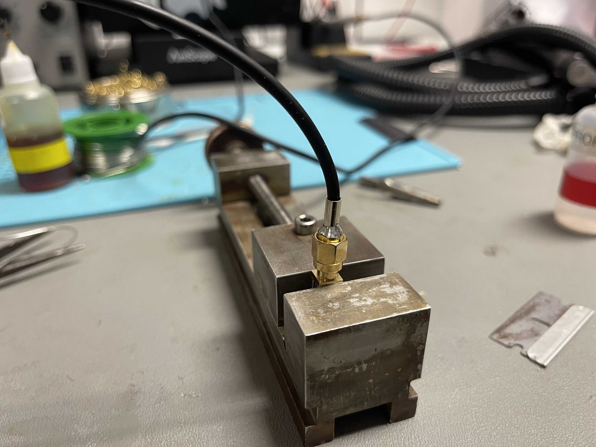
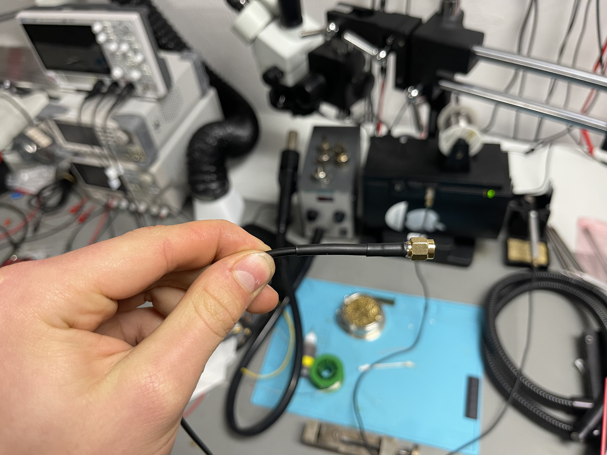

# Cable Assembly Instructions

#### 1. Gather materials

Prepare the following materials to assemble the cable

| **Component**                                                                                                | **Quantity** | **notes**                                                                                                                                            |
| ------------------------------------------------------------------------------------------------------------ | ------------ | ---------------------------------------------------------------------------------------------------------------------------------------------------- |
| RG174 coaxial cable                                                                                          | 1            | Cut to 2m length, for best results, use a cable with a tight braid and high flexibility. MUST have a full braided shield—some chinese wire will not. |
| [Male SMA connector, inline](https://www.digikey.com/en/products/detail/adam-tech/RF2-02B-T-02-50-G/9831397) | 2            |                                                                                                                                                      |
| 3mm  silicone heat-shrink tubing                                                                             | 1            | Cut to 2m length                                                                                                                                     |
| 4mm or 5mm silicone heat-shrink tubing                                                                       | 2            | Cut to 50mm length                                                                                                                                   |
| 6mm or 7mm? heat-shrink tubing                                                                               | 2            | Cut to 20mm length                                                                                                                                   |

#### 2. Deglove the coax

Take a sharp cutting implement and make a vertical incision about 3cm long at one end of the coax jacket. Grab the jacket in one hand and the internal coax cable in the other hand, and pull/rip the coax down through the incision in the jacket. This step increases the flexibility of the cable.

#### 3. Install the silicone heat-shrink tube

Heat each end of the coax with a soldering iron, pushing the shield into the dielectric for about 1cm from each end.

Lightly lubricate the coax and the lubricate the inside of the silicone heat-shrink (WD40 works fine, a teflon-based lubricant would be fantastic).

Feed the coax through the silicone heat-shrink. Apply alligator clips to each end to prevent shifting.

#### 4. Prepare strain relief

Slide the strain relief heat-shrink sections into the center of the cable in the proper order.

#### 5. Install the SMA connectors

Pull back the silicone jacket about ?3-4cm and re-secure it with the alligator clip.
Slide the crimp ferrule onto the coax and up to the jacket.
Cut off the melted section of the coax.
Use a blade to remove 5mm of the coax braid without cutting the dielectric.
Pull back the coax braid 1cm.
Strip an appropriate amount (2mm) of dielectric from the inner wire.
Solder the inner SMA pin onto the inner wire of the coax. You may need to trim the melted dielectric to fit it in the SMA body

Slide the inner SMA pin into the SMA body, moving the coax braid forward to cover the knurled crimp area.
Slide the crimp ferrule over the coax braid to completely cover the knurled crimp area. This may require some force. Use a blade to trim any strands of coax braid that are sticking out.

Solder the ferrule onto the base of the SMA connector. ?Ideally try to get some solder on the inside of the ferrule too.

Slide the silicone jacket under the ferrule if possible (this may require some shrinking and pushing). Otherwise, slide it over the ferrule if possible, otherwise abut it against the ferrule and shrink the end with hot air.

#### 6. Install the strain relief

Slide the narrower piece of strain relief heat-shrink tubing over the ferrule, as close to the SMA connector as it will go, then heat with hot air until the it stops shrinking.
Wait for the cable to cool, then slide the larger piece of strain relief heat-shrink to cover the ferrule. While holding it in place at the cable end, heat with hot air until the tubing fully shrinks.

#### 7. Repeat steps 5 and 6 on the other end of the cable.

Now your silicone SMA cable is complete!

