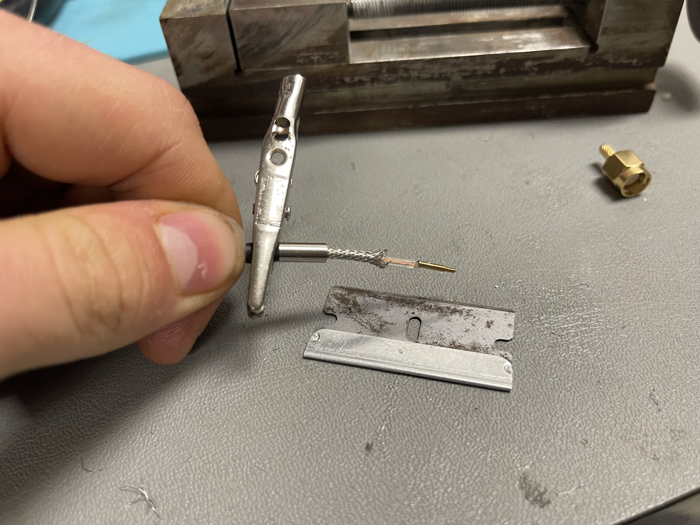
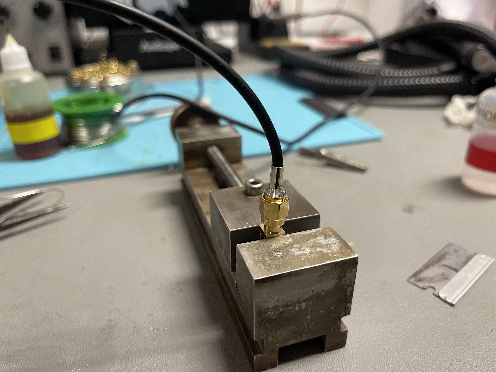
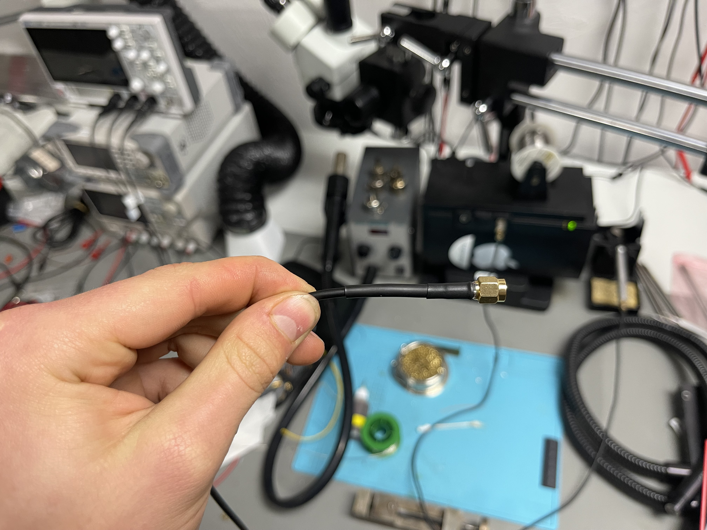

# Cable Assembly Instructions

#### 1. Gather materials

Prepare the following materials to assemble the cable

| **Component**                                             | **Quantity** | **notes**      |
| ------------------------------------------------------------------------------------------------------------ | ------------ | ---------------------------------------------------------------------------------------------------------------------------------------------------- |
| RG174 coaxial cable                                       | 1 | Cut to 1-2m length, depending on how long ou want your cable to be. For best results, use a cable with a tight braid and high flexibility. MUST have a full braided shield—some chinese wire will not. |
| [Male SMA connector, inline](https://www.digikey.com/en/products/detail/adam-tech/RF2-02B-T-02-50-G/9831397) | 2 |  |
| 3mm ID silicone heatshrink tubing                        | 1 | Cut to the same length as your coax                  |
| 3mm ID silicone heatshrink tubing                        | 2 | Cut to 2mm length                                    |
| 5mm ID silicone heatshrink tubing                        | 2 | Cut to 70mm length                                   |
| 6mm ID heatshrink tubing                                 | 2 | Cut to 40mm length                                   |

#### 2. Deglove the coax

Take a sharp cutting implement and make a vertical incision about 3cm long at one end of the coax jacket. Grab the jacket in one hand and the internal coax cable in the other hand, and pull/rip the coax down through the incision in the jacket. Removing the jacket increases the flexibility and decreases the weight of the cable.

#### 3. Install the silicone heatshrink tube

Heat one end of the coax with a soldering iron, pushing the shield into the dielectric for about 5mm from the end. Depending on the coax core material, this may not work and you will instead need to solder the very front of the coax. This is necessary to keep the shield from catching and getting stuck while feeding the coax through the heatshrink.

Apply an aligator clip to the end that is not soldered to prevent the shield from shifting.

Lightly lubricate the coax and the lubricate the inside of the silicone heatshrink with any liquid lubricant. Even mineral oil or WD40 will work fine here. I'd caution against using water, because it might cause corrosion, or vegetable oil, because it can gum up over time.

Feed the coax through the silicone heatshrink. When it becomes difficult to feed, inch it along by doing the following:
Pinch and hold the end of the coax through the heatshrink
Stretch the heatshrink a few centimeters toward the loose end
Pinch and hold the coax through the heatshrink at the end of the stretched section
Release the end of the coax and it should be pushed foward by the contracting heatshrink.

When the coax is completely though, apply alligator clips to each end to prevent shifting within the heatshrink.

#### 4. Prepare strain relief

Slide the strain relief heatshrink sections into the center of the cable in the proper order: 6mm, then 5mm.

#### 5. Install the SMA connectors

Pull back the silicone heatshrink about 3cm and re-secure it with the alligator clip.
Slide a 2mm section of the 3mm ID heatshrink onto the cable (this provides a smooth transistion for strain relief purposes) 
Slide the crimp ferrule onto the coax and up to the jacket.
Cut off the melted/soldered section of the coax.

The following instructions depend on the type of SMA connector you have. We have instructions for two common types from aliexpress.

### Connector type 1
**include image of connector type 1 here**
Use a blade or sharp snips to remove 5mm of the coax shield without cutting the dielectric.
Pull back the coax shield at least 1cm.
Strip 2mm of dielectric from the inner conductor.
Solder the inner SMA pin onto the inner conductor of the coax. You may need to use a blade to trim the melted dielectric to fit it in the SMA body.

Slide the inner SMA pin into the SMA body, moving the coax shield forward to cover the knurled crimp area.
Slide the crimp ferrule over the coax shield to completely cover the knurled crimp area. This may require some force. Use a blade to trim any strands of coax shield that are sticking out.

Crimp or solder the ferrule onto the base of the SMA connector. Soldering is strongly recommended if you don't have the correct size hex crimp tool.

### Connector type 2
**include image of connector type 2 here**
Use a blade or sharp snips to remove 2mm of the coax shield and dielectric to leave just the inner conductor.
Pull back the coax shield at least 1cm.
Solder the inner conductor of the coax to the inner SMA pin.

IMAGE!

Move the coax shield forward to cover the thinner knurled crimp area. Trim any stray wires that go onto the larger knurled area.
Slide the crimp ferrule over the coax shield to completely cover the solder access hole and be flush with the SMA connector.

Crimp or solder the ferrule onto the SMA connector. Soldering is strongly recommended if you don't have the correct size hex crimp tool.

IMAGE!

#### 6. Install the strain relief

Slide the 2mm long section of 3mm ID heatshrink against the crimp ferrule and shrink it in place.

Release the 3mm heatshrink jacket from its aligator clip and slide it over the 2mm long section and the ferrule. This may require lubrication. If the connector is Type 2, only slide the jacket over the smaller section.

Shrink the silcone jacket.

Wait for the cable to cool, then slide the piece of 5mm ID heatshrink tubing over the ferrule, as close to the SMA connector as it will go.
While pushing on the end away from the SMA, use hot air to heat the end next to the SMA until it stops shrinking. Then stop pushing and heat the rest of the 5mm heatshrink.
Wait for the cable to cool, then repeat with the 6mm ID heatshrink.

#### 7. Repeat steps 5 and 6 on the other end of the cable.

Now your silicone SMA cable is complete!

