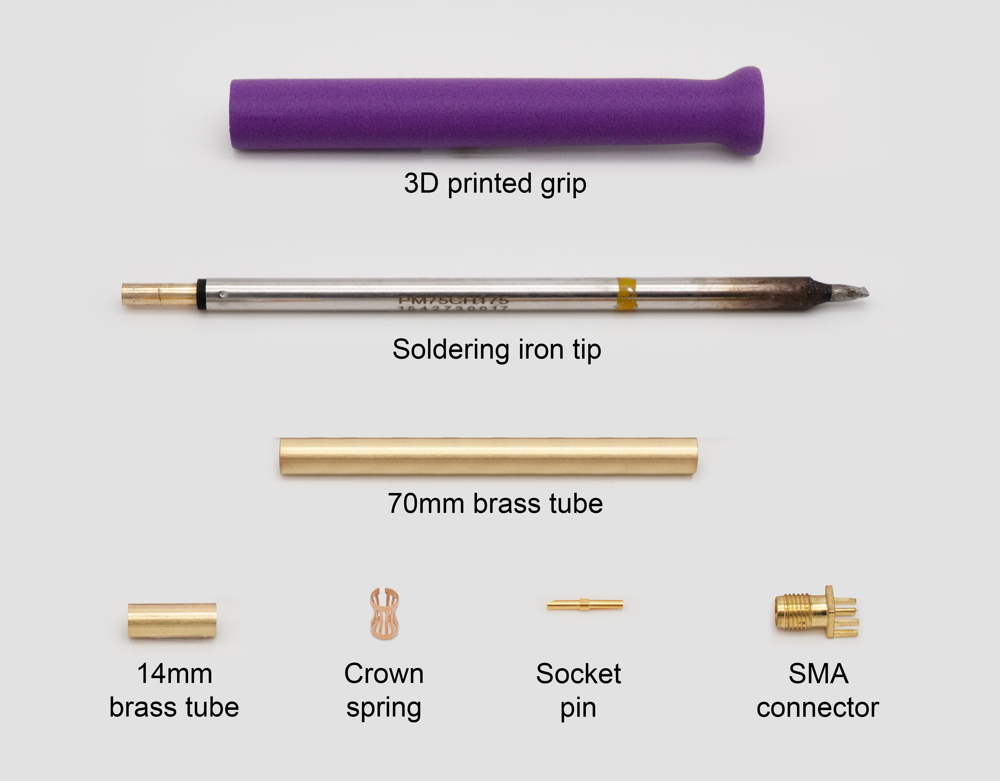
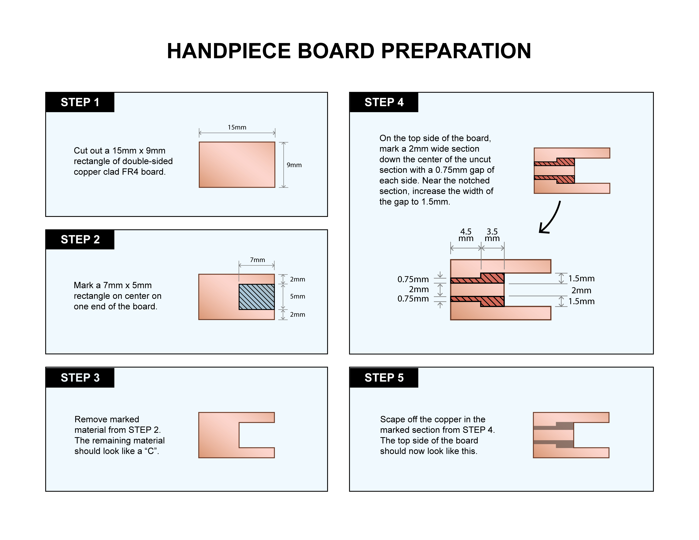
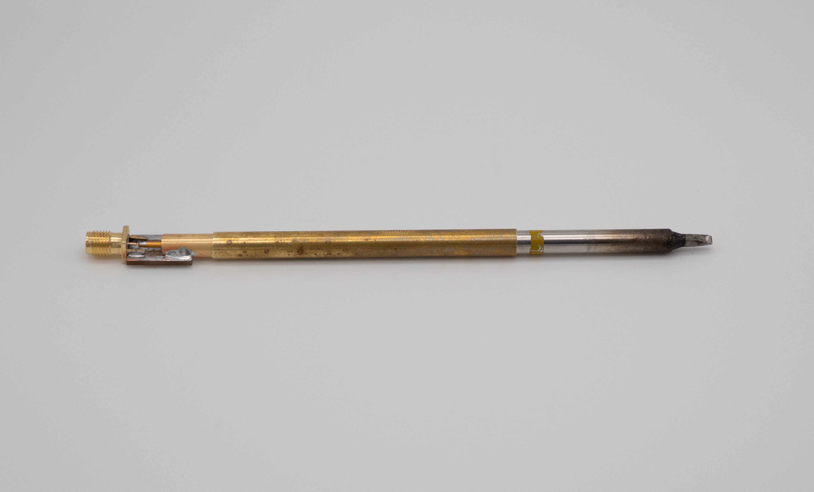
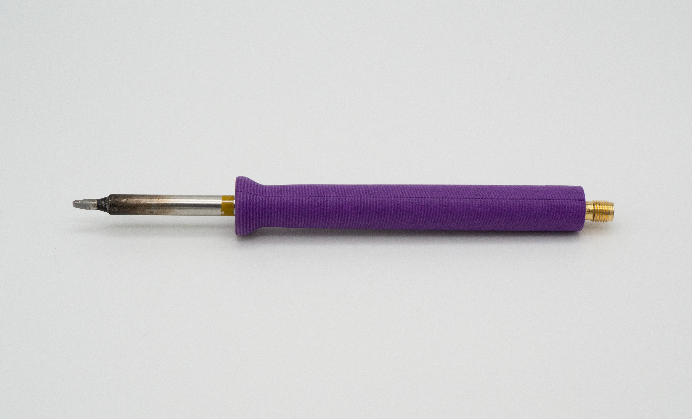

# 470KHz Handpiece Assembly Instructions

#### 1. Gather materials

Prepare your materials for assembling the core of the handpiece. Links below go to where materials can be purchased.

| **Component**                                                                                                               | **Quantity** | **Notes**                                                                                                                                                                                                                                                                                                                                                                                        |
| --------------------------------------------------------------------------------------------------------------------------- | ------------ | ------------------------------------------------------------------------------------------------------------------------------------------------------------------------------------------------------------------------------------------------------------------------------------------------------------------------------------------------------------------------------------------------ |
| Handpiece grip                                                                                                              | 1            | 3D printed handpiece grip, in [3D Printed Grip folder](https://github.com/RadioThermal/RadioThermal_Soldering_OSHW/Handpiece/3D Printed Grip)                                                                                                                                                                                                                                                    |
| [7/32" OD x 0.014" wall brass tube](https://ksmetals.com/products/round-brass-tube-7-32-od-x-0-014-wall-x-12-long-1-piece?) | 1            | Cut to 14mm length                                                                                                                                                                                                                                                                                                                                                                               |
| [1/4" OD x 0.014" wall brass tube](https://ksmetals.com/products/br014-1-4?)                                                | 1            | Cut to 70mm length                                                                                                                                                                                                                                                                                                                                                                               |
| Double sided copper clad FR4 board                                                                                          | 1            | Cut to 9x15mm rectangle                                                                                                                                                                                                                                                                                                                                                                          |
| [Edge launch SMA connector](https://www.digikey.com/en/products/detail/samtec-inc/SMA-J-P-H-ST-EM1/2602450)                 | 1            | 7mm max width, straddle mount variety                                                                                                                                                                                                                                                                                                                                                            |
| [D-Sub female socket contact](https://www.digikey.com/en/products/detail/mh-connectors/MHDM-STF/16983882)                   | 1            | Solder cup variety, can be recycled from used connectors                                                                                                                                                                                                                                                                                                                                         |
| [4.5mmx8mm crown spring](https://www.aliexpress.us/item/3256801561640843.html?)                                             | 1            | May be possible to use 5mm springs, contact seller for more size options                                                                                                                                                                                                                                                                                                                         |
| 470KHz soldering iron tip (not pictured)                                                                                    | 1            | [Metcal/OKi STP/SFP/SCP series](https://store.metcal.com/en-us/shop/cartridges-tips/?SearchParameter=%26%40QueryTerm%3D*%26ContextCategoryUUID%3DA7IKqwMVJm8AAAF33j98yeyl%26OnlineFlag%3D1%26SolderingType%3DProduction%2BSoldering%26System%3DMFR%26%40Sort.name%3D0&PageSize=12&SortingAttribute=name-asc) tips or [Thermaltronics P series](https://www.thermaltronics.com/p_series.php) tips |

#### 2. Prepare circuit board

**Tools and components needed:**

| Component                          | Quantity |
| ---------------------------------- | -------- |
| Double sided copper clad FR4 board | 1        |

| Tool                        | Description/use                                 |
| --------------------------- | ----------------------------------------------- |
| Hacksaw                     | Cutting FR4                                     |
| Vise or clamp               | Holding FR4 during cutting                      |
| Calipers                    | Measuring FR4                                   |
| Narrow chisel               | Cutting FR4 and scraping copper                 |
| Rectangular metal file      | Flattening FR4 edges, cleaning up cuts          |
| Fine point permanent marker | Marking FR4 for cutting and copper for scraping |

#### 3. Attach the SMA connector

**Tools and components needed:**

| Component                                                | Quantity |
| -------------------------------------------------------- | -------- |
| Completed 9x15mm board with notch cut and copper removed | 1        |
| Edge launch SMA connector                                | 1        |

| Tool               | Description/use                                                     |
| ------------------ | ------------------------------------------------------------------- |
| Soldering iron     | Soldering SMA connector to board                                    |
| Solder             | 63/37 alloy is peferable, other leaded or lead free alloys may work |
| Flux               | Liquid type is preferable                                           |
| Needle nose pliers | Bending SMA connector legs                                          |

Once the board has been completed, now it is time to attach the SMA connector. Position the connector so that the center contact touches the 2mm wide center strip on the board, while the outer legs do not touch the center strip. If the connector is a loose fit on the board, bend the outer legs together slightly so that it securely grasps the board. 

Apply soldering flux to all of the legs of the SMA connector. Starting from the outer legs, solder the connector to the board. When soldering the center pin, do not keep the soldering iron on the pin for an extended period of time, as it may damage the plastic insulator inside the connector. Once soldering of the SMA connector is complete, inspect and correct any solder bridges between the center pin and outer legs.

#### 4. Install crown spring into socket tube

**Tools and components needed:**

| Component                                      | Quantity |
| ---------------------------------------------- | -------- |
| 4.5x8mm crown spring                           | 1        |
| 7/32" OD x 0.014" wall brass tube, cut to 14mm | 1        |
| 470KHz soldering iron tip                      | 1        |

| Tool           | Description/use                                                     |
| -------------- | ------------------------------------------------------------------- |
| Soldering iron | Soldering crown spring into tube                                    |
| Solder         | 63/37 alloy is peferable, other leaded or lead free alloys may work |
| Flux           | Liquid type is preferable                                           |

Insert the crown spring into the 14mm piece of brass tubing, then partially insert the coaxial end of the soldering iron tip into the crown spring. Leave about half of the spring visible and ensure there is a 2mm space between the top of the spring and the end of the tubing.

Once the spring has been placed, apply a small amount of liquid soldering flux to the exposed end of the spring. Using a fine tip soldering iron, apply a small amount of solder to where the spring contacts the brass tube. Make sure the solder flows around the spring  to ensure that it says in place during use.

#### 5. Complete the socket assembly

**Tools and components needed:**

| Component                                | Quantity |
| ---------------------------------------- | -------- |
| Board with SMA connector from step 3     | 1        |
| 14mm socket tube with spring from step 4 | 1        |
| D-Sub female socket contact              | 1        |
| 470KHz soldering iron tip                | 1        |

| Tool           | Description/use                                                     |
| -------------- | ------------------------------------------------------------------- |
| Soldering iron | Soldering tube and socket pin to board                              |
| Solder         | 63/37 alloy is peferable, other leaded or lead free alloys may work |
| Flux           | Liquid type is preferable                                           |

Begin by insering the D-Sub female socket contact onto the center pin of the coaxial connector of the soldering iron tip. Verify that the contact is able to easily slide onto the center pin and grasps firmly enough to not fall off when turned upside down. If the contact is loose on the center pin, it may be necessary to squeeze the cut end slightly so that it firmly grasps the pin. Once the socket contact has been fully inserted, slide it approximately 2mm back off of the pin so that it can account for variances in soldering iron tip connectors.

Next, slide the 14mm socket tube all the way down on the outer ring of the coaxial connector on the soldering iron tip. The soldered end of the spring should be facing outwards.

Slide the notched section of the board all of the way onto the socket tube, and ensure the center pin is aligned with the 2mm copper strip.

Apply flux to the points of contact between the socket tube and the board. Solder the socket tube to the board. Make sure that the solder flows onto both the tubing and board, creating a strong bond. It is only necessary to solder on the top side of the board. Be careful not to keep the soldering iron on the board and tubing for an extended period of time. Excessive heat could cause the previosuly soldered components to lose their connection. Finally, solder the D-Sub female contact onto the 2mm strip on the board.

Now the socket assembly is complete. Clean off any remaining flux. Test the socket assembly using a multimeter in contiunity mode with probes connected to the center pin and outside of the SMA connector. If no soldering iron tip is inserted, the connection will be open. If a tip is inserted, the connection will be shorted.

#### 6. Attach the support tube to the socket assembly

**Tools and components needed:**

| Component                                      | Quantity |
| ---------------------------------------------- | -------- |
| Socket assembly from step 5                    | 1        |
| 11/4" OD x 0.014" wall brass tube, cut to 70mm | 1        |
| 470KHz soldering iron tip                      | 1        |

| Tool              | Description/use                                                     |
| ----------------- | ------------------------------------------------------------------- |
| Soldering iron    | Soldering tube and socket pin to board                              |
| Solder            | 63/37 alloy is peferable, other leaded or lead free alloys may work |
| Flux              | Liquid type is preferable                                           |
| Isopropyl alcohol | Removing flux residue                                               |

Slide the 70mm piece of tubing onto the coaxial connector end of the soldering iron tip. Ensure that the tube is slid past the end of the coaxial connector section of the tip. The tubing should be able to slide onto the tip very easily. If the tubing does not slide easily, replace your tubing.

Next, slide the socket assembly fully onto the coaxial connector of the soldering iron tip. Slide the 70mm tube back so that it is covering the first 3mm of the tube in the socket assembly. Use a piece of kapton tape to affix the 70mm tube to the soldering iron tip so that it does not move during the soldering process.

Apply soldering flux to the where the brass tubes contact. Apply a small amount of solder to the joint between the two tubes and rotate the workpiece so that the entirety of the joint between the brass tubes is soldered. Make sure that the solder flows onto both pieces of tubing, creating a strong bond. Finally, remove the kapton tape and soldering iron tip.

The inner portion of the handpiece is complete. Clean off any remaining flux and thoroughly wash the inside of the tube with isopropyl alcohol or another solvent. Test the fit of the tip into the assembly. It should easily slide into the tube and firmly grasp once it reaches the socket. 

#### 7. Installing the handpiece grip

**Tools and components needed:**

| Component                             | Quantity |
| ------------------------------------- | -------- |
| Handpiece innner assembly from step 6 | 1        |
| 3D printed handpiece grip             | 1        |

| Tool           | Description/use                      |
| -------------- | ------------------------------------ |
| 1/4" drill bit | Removing stringing and widening grip |

Inspect the 3D printed handpiece grip to verify that there is no stringing inside the hole. If stringing is present, use a 1/4" drill bit to clear the hole. Next, insert the inner assembly into the 3D printed grip. It should be a tight fit. If the innser assembly cannot be inserted, use a 1/4" drill bit to enlarge the hole. The inner assembly is fully inserted when only the SMA connector is protruding from the grip.

Now your 470KHz handpiece is complete!

