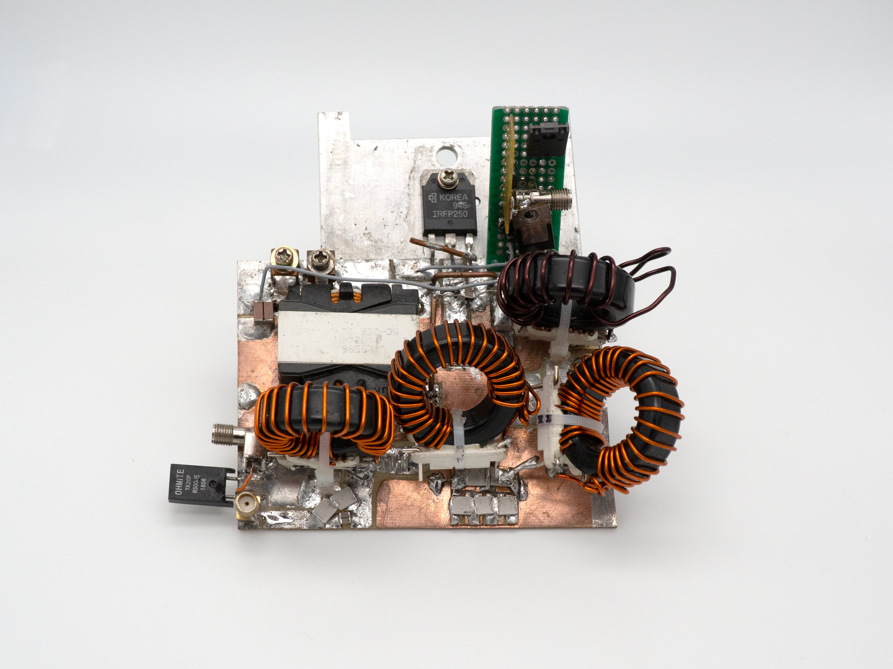
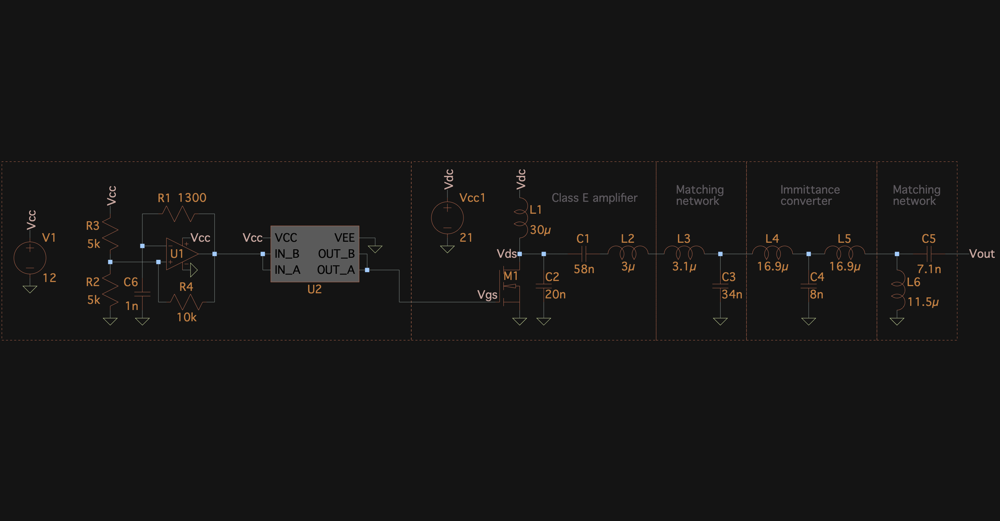

# Power Supply

The power supply is the core of the 470KHz system. It is based upon a class-E amplifier and contains impedance matching circuitry to properly provide power to the soldering iron tip.

The power supply design is currently only available as a schematic, it is in the LTspice format, or as an image (shown below).

#### PCB design and assembly instructions coming soon!
