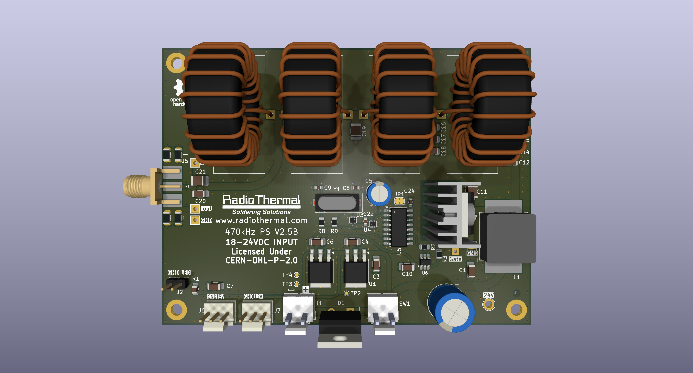

# Power Supply

The power supply is the core of the 470KHz system. It is based upon a class-E amplifier and contains impedance matching circuitry to properly provide power to the soldering iron tip.

#### The PCB

The provided PCB design includes all basic functionality needed to operate a 470KHz soldering iron tip. 

The design includes provisions for inrush current limiting, reverse polarity protection, a cooling fan, and two different types of oscillators. The inductors, apart from the fixed 33uH inductor, are all based around the [Kool Mu 0077932A7 core](https://www.mag-inc.com/Media/Magnetics/Datasheets/0077932A7.pdf), which is currently only available from Digikey, though we are looking for alternatives. 

In version 2.5B of the PCB, we have made a few improvements to reduce cost and increase reliability compared with version 2.3B1. Most notably the oscillator section has been redesigned to eliminate the need for a microcontroller and now only relies on a 7.6MHz crystal oscillator and TTL logic. To reduce costs, we have eliminated the daughterboard by moving everything onto the main board, additionally L2 has been updated to only use a single inductor core from the two cores required on previous versions. Moving all of this new hardware onto the main board has had the consequence of causing us to remove the TO-247 MOSFET option in favor of TO-220 to save space.

Components required to assemble the board can be found in the Digikey list we maintain (new version coming soon, use V2-5B_BOM.csv for now) , please let us know if there is a stocking issue for a component so that we can find a suitable alternative.

#### External DC Power Supplies

For testing we have been using Chicony A15-180P1A 20V 180W power supplies, however any power supply in the 18-24V range with a 100W or higher rating will work. We reccomend utilizing a laptop power supply since they can be found on the used market at reasonable prices. Alternatively, a USB-C PD trigger board can be used in conjunction with a USB PD power supply that supports 20V 5A output.

#### The Case

The case design adds additional functionality to the PCB including a barrel jack for power input, a convenient power switch, power indicator LED, cooling fan, and a ground connection point. The airflow paths of the case have been optomized to exaust out the front and back with the intake on top, keeping all of the inductors cool.

The electrionics parts and fasteners for the case [can be purchased from Digikey](https://www.digikey.com/en/mylists/list/RQ7FUDUM3L). 

The case fan mounts are only designed to support Delta AFB0712 series fans at present, other 70mm fans can be used by removing the fan mounting posts and gluing the four corners of the fan in place. 
