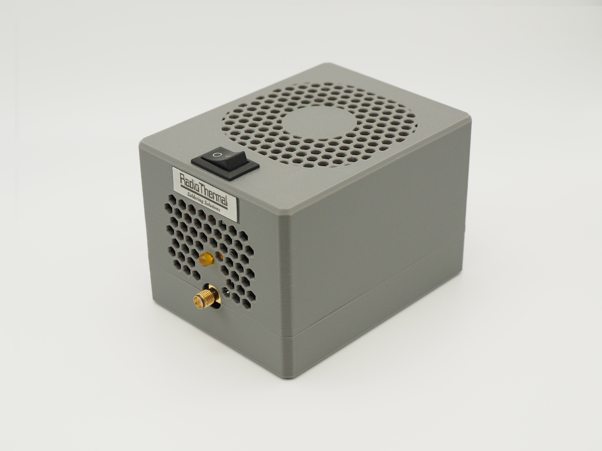
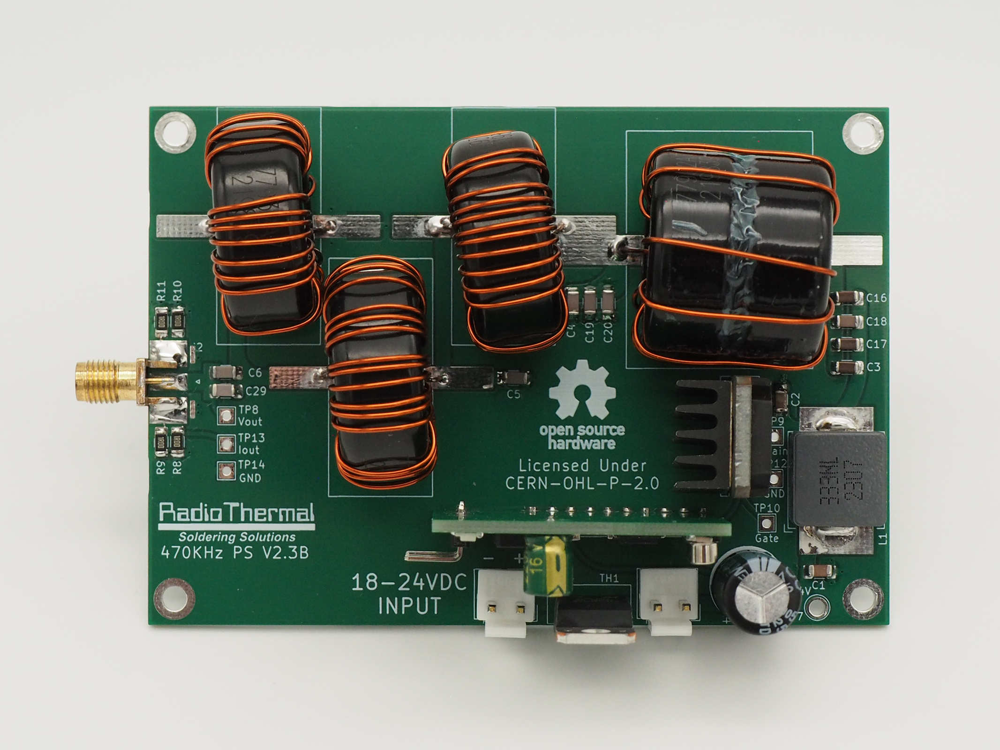
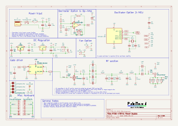
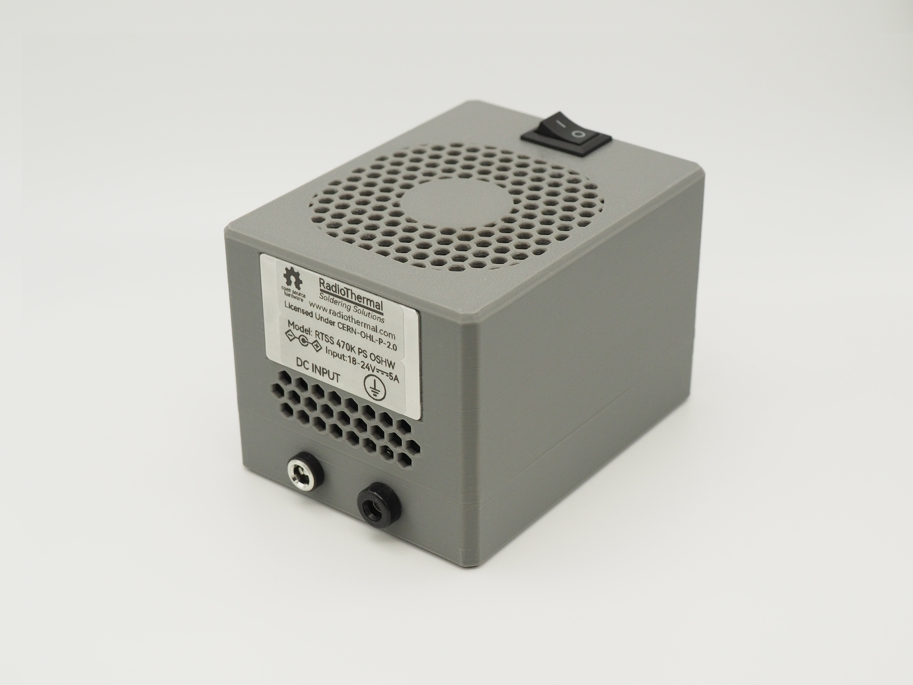

# Power Supply

The power supply is the core of the 470KHz system. It is based upon a class-E amplifier and contains impedance matching circuitry to properly provide power to the soldering iron tip.

#### The PCB

The provided PCB design includes all basic functionality needed to operate a 470KHz soldering iron tip. The oscillator section and gate drive section of the design reside on a vertically mounted daughterboard.

The design includes provisions for inrush current limiting, reverse polarity protection, a cooling fan, and two different types of oscillators. The inductors, apart from the fixed 33uH inductor, are all based around the [Kool Mu 0077932A7 core](https://www.mag-inc.com/Media/Magnetics/Datasheets/0077932A7.pdf), which is currently only available from Digikey, though we are looking for alternatives.

Components required to assemble the board can be found in the [Digikey list we maintain](https://www.mag-inc.com/Media/Magnetics/Datasheets/0077932A7.pdf), please let us know if there is a stocking issue for a component so that we can find a suitable alternative.

#### The Case

Case Design coming soon!
