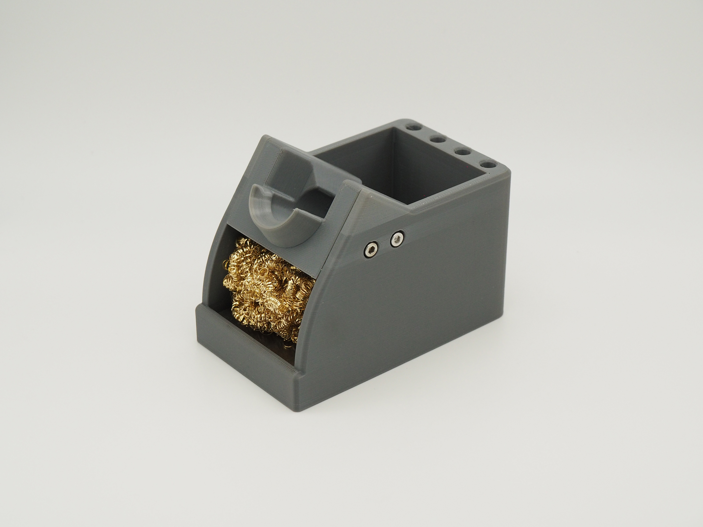

# Workstand Assembly Instructions

#### 1. Gather materials

Prepare your materials for assembling the workstand. Links below go to where materials can be purchased.

| **Component**                  | **Quantity** | **Notes**                                                                                                                                         |
| ------------------------------ | ------------ | ------------------------------------------------------------------------------------------------------------------------------------------------- |
| Workstand base                 | 1            | 3D printed workstand base, in [3D Printed Parts folder](https://github.com/RadioThermal/RadioThermal_Soldering_OSHW/Workstand/3D_Printed_Parts)   |
| Workstand insert               | 1            | 3D printed workstand insert, in [3D Printed Parts folder](https://github.com/RadioThermal/RadioThermal_Soldering_OSHW/Workstand/3D_Printed_Parts) |
| 3/8th" steel plate             | 1            | Weight for the stand, cut to 90x50mm                                                                                                              |
| 12x3mm round N52 magnets       | 8            | Enables tip sleep functionality, not required                                                                                                     |
| M3x8 socket cap bolts          | 4            | M3x10 plastite screws can be used as well                                                                                                         |
| Aluminum tape (155x50mm total) | 1            | Provides heat reistance to 3D prtinted parts, cut two 40x50mm pieces, one 55x50mm piece, and one 20x50mm piece                                    |
| Brass wool                     | 1            |                                                                                                                                                   |
| Self adhesive rubber feet      | 4            | Optional                                                                                                                                          |

#### 2. Assemble workstand insert

**Components needed:**

| Component                   | Quantity |
| --------------------------- | -------- |
| 3D printed workstand insert | 1        |
| 12x3mm round N52 magnets    | 8        |
| 20x50mm aluminum tape       | 1        |

Start by applying the aluminum tape to the flat area on the underside of the 3d printed part. Next seperate the magnets into two stacks of four and note the polarity of each. place each stack of magnets in the cavity on each side of the insert with the same polarity facing towards the center of the tip holder so that each stack of magents repels the other. Affix the magents to the stand with hot glue. 

#### 3. Assemble workstand base

**Components needed:**

| Component                 | Quantity |
| ------------------------- | -------- |
| 3D printed workstand base | 1        |
| Self adhesive rubber feet | 4        |
| 40x50mm aluminum tape     | 2        |
| 55x50mm aluminum tape     | 1        |
| 90x50mm 3/8" steel plate  | 1        |

Begin by flipping the workstand base over and apply the rubber feet to the 4 indicated locations. Back on the top side, apply the two smaller pieces of aluminum tape to each of the inside side walls, directly behind the lower curved section on the front. Next, apply the larger piece of aluminum tape to rear inside wall. Finally, drop in the steel plate, if needed it can be attached to the base with double sided tape or glue.

#### 4. Final assembly

**Components needed:**

| Component                    | Quantity |
| ---------------------------- | -------- |
| Workstand insert from step 2 | 1        |
| Workstand base from step 3   | 1        |
| M3x8 socket cap bolts        | 4        |
| Brass wool                   | 1        |

Begin by taking the base and insert, and aligning the four mounting holes then using the four bolts to attach the insert to the base. Finally the brass wool can be inserted into the area beneath the insert.
