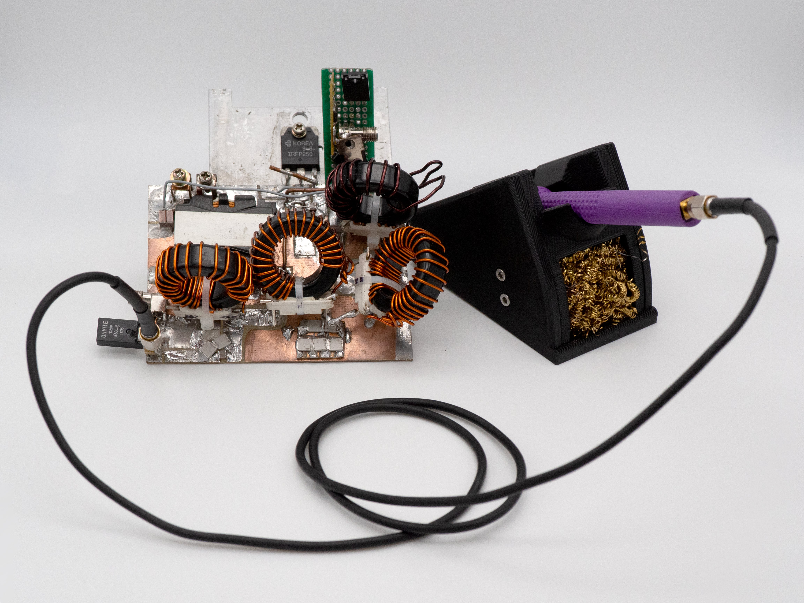

RadioThermal 470KHz Induction Soldering Station - Open Source Hardware
========================

This repository contains the designs and resources to build a high-perfomance induction soldering iron at a relatively low cost. [Check out radiothermal.com for more information.](https://radiothermal.com/products.html)

The 470KHz soldering system is made up of four major components: the power supply, the handpiece, the cable, and the workstand. Follow the links to see the assembly instructions and files for each component.

#### [Power Supply](https://github.com/RadioThermal/RadioThermal_Soldering_OSHW/Power Supply)

The power supply is the core of the 470KHz system. It is based upon a class-E amplifier and contains impedance matching circuitry to properly provide power to the soldering iron tip.

#### [Handpiece](https://github.com/RadioThermal/RadioThermal_Soldering_OSHW/Handpiece)

The handpiece is the primary user interface of the soldering system. It consists of a core built with brass tubing and an outer 3D printed grip for comfort during use.

#### [Cable](https://github.com/RadioThermal/RadioThermal_Soldering_OSHW/cable)

The cable is a specially modified RG-174 coaxial cable with SMA connectors on each end. A silicone jacket has been added for burn resistance, with additional silicone layers on each end for improved strain relief

#### [Workstand](https://github.com/RadioThermal/RadioThermal_Soldering_OSHW/Workstand)

The workstand is a primarly 3D printed part that gives the user a safe place to their hot soldering iron, along with brass wool to clean the tip. Magnets are used to cool down the soldering iron tip when not in use. The back of the stand contains storage for three tips.

#### [Extra - Compatibility Adapters](https://github.com/RadioThermal/RadioThermal_Soldering_OSHW/Adapters)

We have designed compatibility adapters to allow our cable and handpiece to be used with preexisting 470KHz power supplies including Metcal PS, Metcal MFR, and Thermaltronics TMT-2000.

# Project Status

Here is an overview of the current state of completion for each major component of the project

| Component              | Status                                         |
| ---------------------- | ---------------------------------------------- |
| Power Supply           | in-progress, prototype complete                |
| Handpiece              | complete                                       |
| Cable                  | complete, need updated photos for instructions |
| Workstand              | complete, needs instructions                   |
| Compatibility Adapters | complete, needs instructions                   |
